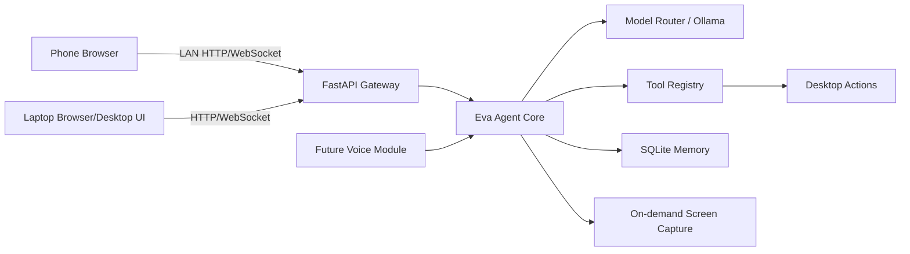
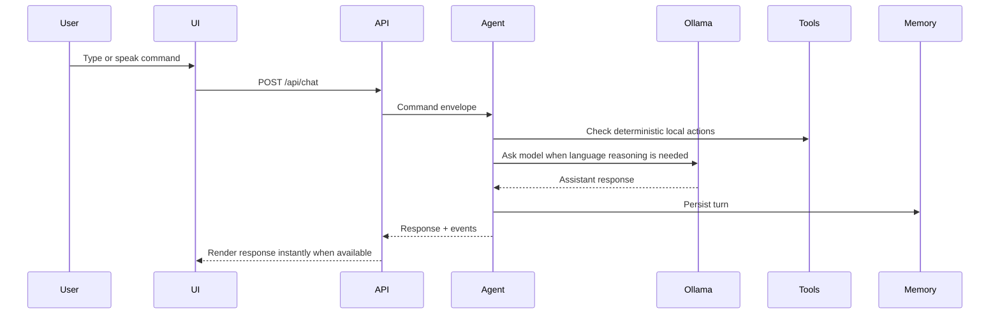

# Eva Agent Architecture

Eva is a fresh, modular desktop agent inspired by OpenHuman's product shape: a local-first agent with a polished desktop UI, typed tools, memory, voice extensibility, and remote device access. This project does not copy OpenHuman source code; it borrows the architectural ideas so Eva can evolve without being trapped in the previous C++ dependency stack.

## Design Goals

- **Local-first control:** Eva runs on the laptop and uses local services first, especially Ollama.
- **Phone access:** Any phone on the same trusted network can open Eva's web UI and control the desktop agent after pairing.
- **On-demand sensing:** Screen capture and camera-style visual context happen only when requested. No always-on camera.
- **Modular tools:** Every action is an allowlisted tool with a name, schema, and safety boundary.
- **Voice-ready:** Voice-to-voice is a module boundary from day one, not hardwired into the core loop.
- **UI-first experience:** The UI should feel like a real command center, not a debug panel.

## High-Level System

## Runtime Modules

- `backend/eva/core`: configuration, event bus, app lifecycle, response envelopes.
- `backend/eva/models`: model adapters. The first adapter talks to local Ollama.
- `backend/eva/tools`: allowlisted actions such as system status, opening approved apps, and future command execution.
- `backend/eva/memory`: local SQLite conversations and event history.
- `backend/eva/screen`: on-demand laptop screen snapshots for phone viewing and future vision prompts.
- `backend/eva/voice`: interfaces for STT, TTS, wake-word, and barge-in. The MVP keeps these as clean seams.
- `backend/eva/api`: HTTP routes and WebSocket gateway.
- `frontend`: responsive command-center UI served by the backend.

## Phone Control Flow

Eva binds to `127.0.0.1:8765` by default; phone control requires explicitly
setting `[server] host = "0.0.0.0"` in `config/eva.toml` on a trusted network.

1. Eva starts on the laptop at `<configured-host>:8765`.
2. The phone opens `http://<laptop-ip>:8765`.
3. The UI connects to `/ws` and calls `/api/chat` for commands.
4. Screen viewing uses `/api/screen/snapshot`, which captures the laptop screen only when the user presses the screen button.
5. Future secure pairing can promote this MVP token into QR pairing plus per-device sessions.

## Agent Loop

## Security Boundaries

- Network access defaults to LAN only.
- Dangerous desktop actions must be explicit allowlisted tools.
- Screen access is pull-based, never continuously streamed by default.
- Camera and microphone are future modules and must request activation per task.
- Secrets and local model files stay inside `eva-agent` unless the user intentionally imports assets.

## MVP Capabilities

- Launch Eva backend and UI from one command.
- Chat with Eva through local Ollama when available.
- Show a clear error if Ollama is unavailable instead of silently hanging.
- View laptop screen from the UI on demand.
- Store conversation history locally in SQLite.
- Keep voice-to-voice, wake word, and advanced phone pairing modular for the next phase.

## Next Phases

- **Phase 2:** Add streaming model responses, tool-call JSON, app launching, window control, and safer command execution.
- **Phase 3:** Add voice-to-voice with Whisper/Piper or faster local alternatives.
- **Phase 4:** Add QR phone pairing, encrypted sessions, and low-latency screen streaming.
- **Phase 5:** Add vision workflows: "look at my screen and explain/fix this" and one-shot camera capture on request.
